**TL;DR:** Data augmentation is rarely applied to audio generative modeling. The reason has been explained by (Jun et al., 2020): the use of transformations can distort the data distribution that the model learns to generate, resulting in outputs that are even worse at resembling the original data. 

We explore Beta Distribution Augmentation (BDA) to allow a range of radical audio augmentations that are typically seen only in non-generative tasks to be used in generative tasks, thus leveraging small datasets for training high-quality audio generative models with accurate musical controls.

<table class="audio-table" id="intro">
  <tbody>
    <!-- Melody 417 -->
    <tr>
      <td rowspan="4">
        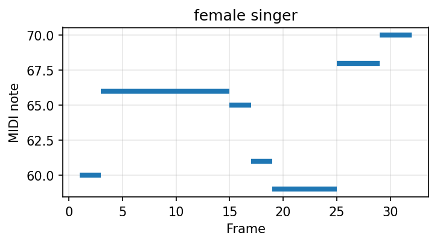
        <audio controls preload="none"><source src="assets/audio/ablation/1.2k_40_417_melody_sine_abl.mp3" type="audio/mpeg"></audio>
      </td>
    </tr>
    <tr>
      <td>
        PLaTune (Baseline) trained on 1h audio data, resulting in poor audio quality and inaccuracy MIDI control due to model underfit.
        <audio controls preload="none"><source src="assets/audio/ablation/1.2k_40_417_PLaTune_Baseline_style1_abl.mp3" type="audio/mpeg"></audio>
      </td>
    </tr>
    <tr>
      <td>
        PLaTune (Baseline) trained with random pitch-shifting as data augmentation. The model learns the transformed audio data, resulting audible transformation artifacts (i.e., the chipmunk effect).
      <audio controls preload="none"><source src="assets/audio/ablation/1.2k_40_417_PLaTune-BDA_a=1_style1_abl.mp3" type="audio/mpeg"></audio></td>
    </tr>
    <tr>
      <td>
      PLaTune-BDA (Ours) trained on 1h audio data, with random pitch-shifting applied, resulting in better generation with accuracy control, free from transformation artifacts.
      <audio controls preload="none"><source src="assets/audio/ablation/1.2k_40_417_PLaTune-BDA_Ours_style1_abl.mp3" type="audio/mpeg"></audio></td>
    </tr>
  </tbody>
</table>

---

## Abstract

Training deep generative models for musical audio with limited data remains challenging. In this paper, we introduce **Beta Distribution Augmentation (BDA)** as a data augmentation technique that provides additional training data without modifying the data distribution learned by the model, thereby allowing generative models to be trained on significantly smaller datasets. We combine BDA with a range of audio transformations that are typically used only in non-generative tasks. We demonstrate that, compared to the baseline, our method achieves better generation quality while requiring only 25% of the training data, and remains competitive using only 6.25% (~1h) of data. We expect this to open discussion of how small and ethically sourced datasets can be used as efficiently as large-scale datasets for generative modelling.

<!-- ## Method Overivew

<figure class="diagram">
  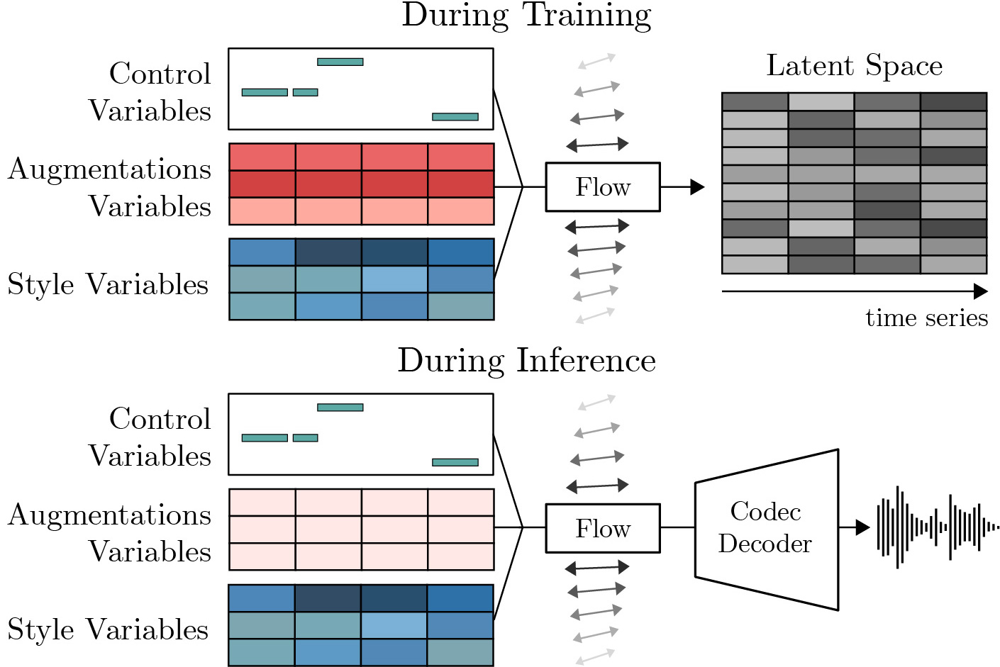
  <figcaption>Figure 1: Method overview.</figcaption>
</figure> -->

---

## Experiment 3: Comparing with Other Methods

### Attribute Transfer

Extract the control-style variables given a source and a target sample, swap the style and instrument.

<table class="audio-table">
  <thead>
    <tr>
      <th>Source</th>
      <th>Target</th>
      <th>Training Set Size</th>
      <th>PLaTune-BDA (Ours)</th>
      <th>WavAug (no BDA)</th>
      <th>PLaTune (Baseline)</th>
    </tr>
  </thead>
  <tbody>
    <!-- Pair 27_8 -->
    <tr>
      <td rowspan="3"><audio controls preload="none"><source src="assets/audio/style_transfer/1.2k/1.2k_27_8_source.mp3" type="audio/mpeg"></audio>(Melody + Dynamics)</td>
      <td rowspan="3"><audio controls preload="none"><source src="assets/audio/style_transfer/1.2k/1.2k_27_8_target.mp3" type="audio/mpeg"></audio>(Instrument + Style)</td>
      <td>🔴 1.2k (~1h)</td>
      <td><audio controls preload="none"><source src="assets/audio/style_transfer/1.2k/1.2k_27_8_PLaTune-BDA_Ours.mp3" type="audio/mpeg"></audio></td>
      <td><audio controls preload="none"><source src="assets/audio/style_transfer/1.2k/1.2k_27_8_WavAug_no_BDA.mp3" type="audio/mpeg"></audio></td>
      <td><audio controls preload="none"><source src="assets/audio/style_transfer/1.2k/1.2k_27_8_PLaTune_Baseline.mp3" type="audio/mpeg"></audio></td>
    </tr>
    <tr>
      <td>🟡 4.8k (~4h)</td>
      <td><audio controls preload="none"><source src="assets/audio/style_transfer/4.8k/4.8k_27_8_PLaTune-BDA_Ours.mp3" type="audio/mpeg"></audio></td>
      <td><audio controls preload="none"><source src="assets/audio/style_transfer/4.8k/4.8k_27_8_WavAug_no_BDA.mp3" type="audio/mpeg"></audio></td>
      <td><audio controls preload="none"><source src="assets/audio/style_transfer/4.8k/4.8k_27_8_PLaTune_Baseline.mp3" type="audio/mpeg"></audio></td>
    </tr>
    <tr>
      <td>🟢 19.2k (~16h)</td>
      <td><audio controls preload="none"><source src="assets/audio/style_transfer/19.2k/19.2k_27_8_PLaTune-BDA_Ours.mp3" type="audio/mpeg"></audio></td>
      <td><audio controls preload="none"><source src="assets/audio/style_transfer/19.2k/19.2k_27_8_WavAug_no_BDA.mp3" type="audio/mpeg"></audio></td>
      <td><audio controls preload="none"><source src="assets/audio/style_transfer/19.2k/19.2k_27_8_PLaTune_Baseline.mp3" type="audio/mpeg"></audio></td>
    </tr>
    <!-- Pair 58_59 -->
    <tr>
      <td rowspan="3"><audio controls preload="none"><source src="assets/audio/style_transfer/1.2k/1.2k_58_59_source.mp3" type="audio/mpeg"></audio>(Melody + Dynamics)</td>
      <td rowspan="3"><audio controls preload="none"><source src="assets/audio/style_transfer/1.2k/1.2k_58_59_target.mp3" type="audio/mpeg"></audio>(Instrument + Style)</td>
      <td>🔴 1.2k (~1h)</td>
      <td><audio controls preload="none"><source src="assets/audio/style_transfer/1.2k/1.2k_58_59_PLaTune-BDA_Ours.mp3" type="audio/mpeg"></audio></td>
      <td><audio controls preload="none"><source src="assets/audio/style_transfer/1.2k/1.2k_58_59_WavAug_no_BDA.mp3" type="audio/mpeg"></audio></td>
      <td><audio controls preload="none"><source src="assets/audio/style_transfer/1.2k/1.2k_58_59_PLaTune_Baseline.mp3" type="audio/mpeg"></audio></td>
    </tr>
    <tr>
      <td>🟡 4.8k (~4h)</td>
      <td><audio controls preload="none"><source src="assets/audio/style_transfer/4.8k/4.8k_58_59_PLaTune-BDA_Ours.mp3" type="audio/mpeg"></audio></td>
      <td><audio controls preload="none"><source src="assets/audio/style_transfer/4.8k/4.8k_58_59_WavAug_no_BDA.mp3" type="audio/mpeg"></audio></td>
      <td><audio controls preload="none"><source src="assets/audio/style_transfer/4.8k/4.8k_58_59_PLaTune_Baseline.mp3" type="audio/mpeg"></audio></td>
    </tr>
    <tr>
      <td>🟢 19.2k (~16h)</td>
      <td><audio controls preload="none"><source src="assets/audio/style_transfer/19.2k/19.2k_58_59_PLaTune-BDA_Ours.mp3" type="audio/mpeg"></audio></td>
      <td><audio controls preload="none"><source src="assets/audio/style_transfer/19.2k/19.2k_58_59_WavAug_no_BDA.mp3" type="audio/mpeg"></audio></td>
      <td><audio controls preload="none"><source src="assets/audio/style_transfer/19.2k/19.2k_58_59_PLaTune_Baseline.mp3" type="audio/mpeg"></audio></td>
    </tr>
    <!-- Pair 88_79 -->
    <tr>
      <td rowspan="3"><audio controls preload="none"><source src="assets/audio/style_transfer/1.2k/1.2k_88_79_source.mp3" type="audio/mpeg"></audio>(Melody + Dynamics)</td>
      <td rowspan="3"><audio controls preload="none"><source src="assets/audio/style_transfer/1.2k/1.2k_88_79_target.mp3" type="audio/mpeg"></audio>(Instrument + Style)</td>
      <td>🔴 1.2k (~1h)</td>
      <td><audio controls preload="none"><source src="assets/audio/style_transfer/1.2k/1.2k_88_79_PLaTune-BDA_Ours.mp3" type="audio/mpeg"></audio></td>
      <td><audio controls preload="none"><source src="assets/audio/style_transfer/1.2k/1.2k_88_79_WavAug_no_BDA.mp3" type="audio/mpeg"></audio></td>
      <td><audio controls preload="none"><source src="assets/audio/style_transfer/1.2k/1.2k_88_79_PLaTune_Baseline.mp3" type="audio/mpeg"></audio></td>
    </tr>
    <tr>
      <td>🟡 4.8k (~4h)</td>
      <td><audio controls preload="none"><source src="assets/audio/style_transfer/4.8k/4.8k_88_79_PLaTune-BDA_Ours.mp3" type="audio/mpeg"></audio></td>
      <td><audio controls preload="none"><source src="assets/audio/style_transfer/4.8k/4.8k_88_79_WavAug_no_BDA.mp3" type="audio/mpeg"></audio></td>
      <td><audio controls preload="none"><source src="assets/audio/style_transfer/4.8k/4.8k_88_79_PLaTune_Baseline.mp3" type="audio/mpeg"></audio></td>
    </tr>
    <tr>
      <td>🟢 19.2k (~16h)</td>
      <td><audio controls preload="none"><source src="assets/audio/style_transfer/19.2k/19.2k_88_79_PLaTune-BDA_Ours.mp3" type="audio/mpeg"></audio></td>
      <td><audio controls preload="none"><source src="assets/audio/style_transfer/19.2k/19.2k_88_79_WavAug_no_BDA.mp3" type="audio/mpeg"></audio></td>
      <td><audio controls preload="none"><source src="assets/audio/style_transfer/19.2k/19.2k_88_79_PLaTune_Baseline.mp3" type="audio/mpeg"></audio></td>
    </tr>
    <!-- Pair 29_57 -->
    <tr>
      <td rowspan="3"><audio controls preload="none"><source src="assets/audio/style_transfer/1.2k/1.2k_29_57_source.mp3" type="audio/mpeg"></audio>(Melody + Dynamics)</td>
      <td rowspan="3"><audio controls preload="none"><source src="assets/audio/style_transfer/1.2k/1.2k_29_57_target.mp3" type="audio/mpeg"></audio>(Instrument + Style)</td>
      <td>🔴 1.2k (~1h)</td>
      <td><audio controls preload="none"><source src="assets/audio/style_transfer/1.2k/1.2k_29_57_PLaTune-BDA_Ours.mp3" type="audio/mpeg"></audio></td>
      <td><audio controls preload="none"><source src="assets/audio/style_transfer/1.2k/1.2k_29_57_WavAug_no_BDA.mp3" type="audio/mpeg"></audio></td>
      <td><audio controls preload="none"><source src="assets/audio/style_transfer/1.2k/1.2k_29_57_PLaTune_Baseline.mp3" type="audio/mpeg"></audio></td>
    </tr>
    <tr>
      <td>🟡 4.8k (~4h)</td>
      <td><audio controls preload="none"><source src="assets/audio/style_transfer/4.8k/4.8k_29_57_PLaTune-BDA_Ours.mp3" type="audio/mpeg"></audio></td>
      <td><audio controls preload="none"><source src="assets/audio/style_transfer/4.8k/4.8k_29_57_WavAug_no_BDA.mp3" type="audio/mpeg"></audio></td>
      <td><audio controls preload="none"><source src="assets/audio/style_transfer/4.8k/4.8k_29_57_PLaTune_Baseline.mp3" type="audio/mpeg"></audio></td>
    </tr>
    <tr>
      <td>🟢 19.2k (~16h)</td>
      <td><audio controls preload="none"><source src="assets/audio/style_transfer/19.2k/19.2k_29_57_PLaTune-BDA_Ours.mp3" type="audio/mpeg"></audio></td>
      <td><audio controls preload="none"><source src="assets/audio/style_transfer/19.2k/19.2k_29_57_WavAug_no_BDA.mp3" type="audio/mpeg"></audio></td>
      <td><audio controls preload="none"><source src="assets/audio/style_transfer/19.2k/19.2k_29_57_PLaTune_Baseline.mp3" type="audio/mpeg"></audio></td>
    </tr>
    <!-- Pair 47_20 -->
    <tr>
      <td rowspan="3"><audio controls preload="none"><source src="assets/audio/style_transfer/1.2k/1.2k_47_20_source.mp3" type="audio/mpeg"></audio>(Melody + Dynamics)</td>
      <td rowspan="3"><audio controls preload="none"><source src="assets/audio/style_transfer/1.2k/1.2k_47_20_target.mp3" type="audio/mpeg"></audio>(Instrument + Style)</td>
      <td>🔴 1.2k (~1h)</td>
      <td><audio controls preload="none"><source src="assets/audio/style_transfer/1.2k/1.2k_47_20_PLaTune-BDA_Ours.mp3" type="audio/mpeg"></audio></td>
      <td><audio controls preload="none"><source src="assets/audio/style_transfer/1.2k/1.2k_47_20_WavAug_no_BDA.mp3" type="audio/mpeg"></audio></td>
      <td><audio controls preload="none"><source src="assets/audio/style_transfer/1.2k/1.2k_47_20_PLaTune_Baseline.mp3" type="audio/mpeg"></audio></td>
    </tr>
    <tr>
      <td>🟡 4.8k (~4h)</td>
      <td><audio controls preload="none"><source src="assets/audio/style_transfer/4.8k/4.8k_47_20_PLaTune-BDA_Ours.mp3" type="audio/mpeg"></audio></td>
      <td><audio controls preload="none"><source src="assets/audio/style_transfer/4.8k/4.8k_47_20_WavAug_no_BDA.mp3" type="audio/mpeg"></audio></td>
      <td><audio controls preload="none"><source src="assets/audio/style_transfer/4.8k/4.8k_47_20_PLaTune_Baseline.mp3" type="audio/mpeg"></audio></td>
    </tr>
    <tr>
      <td>🟢 19.2k (~16h)</td>
      <td><audio controls preload="none"><source src="assets/audio/style_transfer/19.2k/19.2k_47_20_PLaTune-BDA_Ours.mp3" type="audio/mpeg"></audio></td>
      <td><audio controls preload="none"><source src="assets/audio/style_transfer/19.2k/19.2k_47_20_WavAug_no_BDA.mp3" type="audio/mpeg"></audio></td>
      <td><audio controls preload="none"><source src="assets/audio/style_transfer/19.2k/19.2k_47_20_PLaTune_Baseline.mp3" type="audio/mpeg"></audio></td>
    </tr>
    <!-- Pair 2_0 -->
    <tr>
      <td rowspan="3"><audio controls preload="none"><source src="assets/audio/style_transfer/1.2k/1.2k_2_0_source.mp3" type="audio/mpeg"></audio>(Melody + Dynamics)</td>
      <td rowspan="3"><audio controls preload="none"><source src="assets/audio/style_transfer/1.2k/1.2k_2_0_target.mp3" type="audio/mpeg"></audio>(Instrument + Style)</td>
      <td>🔴 1.2k (~1h)</td>
      <td><audio controls preload="none"><source src="assets/audio/style_transfer/1.2k/1.2k_2_0_PLaTune-BDA_Ours.mp3" type="audio/mpeg"></audio></td>
      <td><audio controls preload="none"><source src="assets/audio/style_transfer/1.2k/1.2k_2_0_WavAug_no_BDA.mp3" type="audio/mpeg"></audio></td>
      <td><audio controls preload="none"><source src="assets/audio/style_transfer/1.2k/1.2k_2_0_PLaTune_Baseline.mp3" type="audio/mpeg"></audio></td>
    </tr>
    <tr>
      <td>🟡 4.8k (~4h)</td>
      <td><audio controls preload="none"><source src="assets/audio/style_transfer/4.8k/4.8k_2_0_PLaTune-BDA_Ours.mp3" type="audio/mpeg"></audio></td>
      <td><audio controls preload="none"><source src="assets/audio/style_transfer/4.8k/4.8k_2_0_WavAug_no_BDA.mp3" type="audio/mpeg"></audio></td>
      <td><audio controls preload="none"><source src="assets/audio/style_transfer/4.8k/4.8k_2_0_PLaTune_Baseline.mp3" type="audio/mpeg"></audio></td>
    </tr>
    <tr>
      <td>🟢 19.2k (~16h)</td>
      <td><audio controls preload="none"><source src="assets/audio/style_transfer/19.2k/19.2k_2_0_PLaTune-BDA_Ours.mp3" type="audio/mpeg"></audio></td>
      <td><audio controls preload="none"><source src="assets/audio/style_transfer/19.2k/19.2k_2_0_WavAug_no_BDA.mp3" type="audio/mpeg"></audio></td>
      <td><audio controls preload="none"><source src="assets/audio/style_transfer/19.2k/19.2k_2_0_PLaTune_Baseline.mp3" type="audio/mpeg"></audio></td>
    </tr>
    <!-- Pair 19_18 -->
    <tr>
      <td rowspan="3"><audio controls preload="none"><source src="assets/audio/style_transfer/1.2k/1.2k_19_18_source.mp3" type="audio/mpeg"></audio>(Melody + Dynamics)</td>
      <td rowspan="3"><audio controls preload="none"><source src="assets/audio/style_transfer/1.2k/1.2k_19_18_target.mp3" type="audio/mpeg"></audio>(Instrument + Style)</td>
      <td>🔴 1.2k (~1h)</td>
      <td><audio controls preload="none"><source src="assets/audio/style_transfer/1.2k/1.2k_19_18_PLaTune-BDA_Ours.mp3" type="audio/mpeg"></audio></td>
      <td><audio controls preload="none"><source src="assets/audio/style_transfer/1.2k/1.2k_19_18_WavAug_no_BDA.mp3" type="audio/mpeg"></audio></td>
      <td><audio controls preload="none"><source src="assets/audio/style_transfer/1.2k/1.2k_19_18_PLaTune_Baseline.mp3" type="audio/mpeg"></audio></td>
    </tr>
    <tr>
      <td>🟡 4.8k (~4h)</td>
      <td><audio controls preload="none"><source src="assets/audio/style_transfer/4.8k/4.8k_19_18_PLaTune-BDA_Ours.mp3" type="audio/mpeg"></audio></td>
      <td><audio controls preload="none"><source src="assets/audio/style_transfer/4.8k/4.8k_19_18_WavAug_no_BDA.mp3" type="audio/mpeg"></audio></td>
      <td><audio controls preload="none"><source src="assets/audio/style_transfer/4.8k/4.8k_19_18_PLaTune_Baseline.mp3" type="audio/mpeg"></audio></td>
    </tr>
    <tr>
      <td>🟢 19.2k (~16h)</td>
      <td><audio controls preload="none"><source src="assets/audio/style_transfer/19.2k/19.2k_19_18_PLaTune-BDA_Ours.mp3" type="audio/mpeg"></audio></td>
      <td><audio controls preload="none"><source src="assets/audio/style_transfer/19.2k/19.2k_19_18_WavAug_no_BDA.mp3" type="audio/mpeg"></audio></td>
      <td><audio controls preload="none"><source src="assets/audio/style_transfer/19.2k/19.2k_19_18_PLaTune_Baseline.mp3" type="audio/mpeg"></audio></td>
    </tr>
  </tbody>
</table>

### Conditional Synthesis

For each input melody (shown as a piano roll), models synthesize audio in 5 different styles. The sine wave reference renders the melody with a pure tone for comparison.
#### 🔴 Training Set Size: 1.2k (~1h)

<table class="audio-table">
  <thead>
    <tr>
      <th>Melody</th>
      <th>Style</th>
      <th>PLaTune-BDA (Ours)</th>
      <th>WavAug (no BDA)</th>
      <th>PLaTune (Baseline)</th>
    </tr>
  </thead>
  <tbody>
    <!-- Melody 15 -->
    <tr>
      <td rowspan="3">
        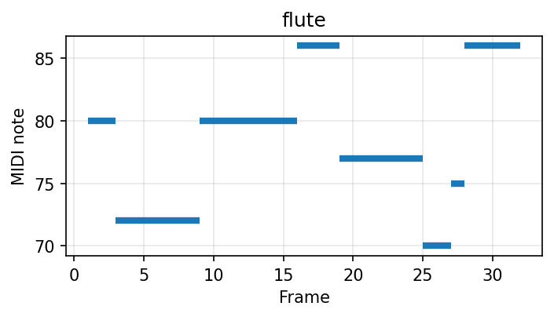
        <audio controls preload="none"><source src="assets/audio/conditional_synthesis/1.2k/1.2k_15_melody_sine.mp3" type="audio/mpeg"></audio>
      </td>
      <td>1</td>
      <td><audio controls preload="none"><source src="assets/audio/conditional_synthesis/1.2k/1.2k_15_PLaTune-BDA_Ours_style3.mp3" type="audio/mpeg"></audio></td>
      <td><audio controls preload="none"><source src="assets/audio/conditional_synthesis/1.2k/1.2k_15_WavAug_no_BDA_style3.mp3" type="audio/mpeg"></audio></td>
      <td><audio controls preload="none"><source src="assets/audio/conditional_synthesis/1.2k/1.2k_15_PLaTune_Baseline_style3.mp3" type="audio/mpeg"></audio></td>
    </tr>
    <tr>
      <td>2</td>
      <td><audio controls preload="none"><source src="assets/audio/conditional_synthesis/1.2k/1.2k_15_PLaTune-BDA_Ours_style2.mp3" type="audio/mpeg"></audio></td>
      <td><audio controls preload="none"><source src="assets/audio/conditional_synthesis/1.2k/1.2k_15_WavAug_no_BDA_style2.mp3" type="audio/mpeg"></audio></td>
      <td><audio controls preload="none"><source src="assets/audio/conditional_synthesis/1.2k/1.2k_15_PLaTune_Baseline_style2.mp3" type="audio/mpeg"></audio></td>
    </tr>
    <tr>
      <td>3</td>
      <td><audio controls preload="none"><source src="assets/audio/conditional_synthesis/1.2k/1.2k_15_PLaTune-BDA_Ours_style1.mp3" type="audio/mpeg"></audio></td>
      <td><audio controls preload="none"><source src="assets/audio/conditional_synthesis/1.2k/1.2k_15_WavAug_no_BDA_style1.mp3" type="audio/mpeg"></audio></td>
      <td><audio controls preload="none"><source src="assets/audio/conditional_synthesis/1.2k/1.2k_15_PLaTune_Baseline_style1.mp3" type="audio/mpeg"></audio></td>
    </tr>
    <!-- Melody 22 -->
    <tr>
      <td rowspan="3">
        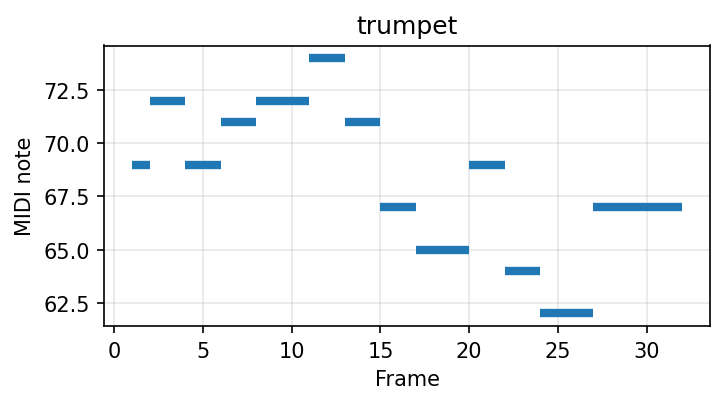
        <audio controls preload="none"><source src="assets/audio/conditional_synthesis/1.2k/1.2k_22_melody_sine.mp3" type="audio/mpeg"></audio>
      </td>
      <td>1</td>
      <td><audio controls preload="none"><source src="assets/audio/conditional_synthesis/1.2k/1.2k_22_PLaTune-BDA_Ours_style1.mp3" type="audio/mpeg"></audio></td>
      <td><audio controls preload="none"><source src="assets/audio/conditional_synthesis/1.2k/1.2k_22_WavAug_no_BDA_style1.mp3" type="audio/mpeg"></audio></td>
      <td><audio controls preload="none"><source src="assets/audio/conditional_synthesis/1.2k/1.2k_22_PLaTune_Baseline_style1.mp3" type="audio/mpeg"></audio></td>
    </tr>
    <tr>
      <td>2</td>
      <td><audio controls preload="none"><source src="assets/audio/conditional_synthesis/1.2k/1.2k_22_PLaTune-BDA_Ours_style3.mp3" type="audio/mpeg"></audio></td>
      <td><audio controls preload="none"><source src="assets/audio/conditional_synthesis/1.2k/1.2k_22_WavAug_no_BDA_style3.mp3" type="audio/mpeg"></audio></td>
      <td><audio controls preload="none"><source src="assets/audio/conditional_synthesis/1.2k/1.2k_22_PLaTune_Baseline_style3.mp3" type="audio/mpeg"></audio></td>
    </tr>
    <tr>
      <td>3</td>
      <td><audio controls preload="none"><source src="assets/audio/conditional_synthesis/1.2k/1.2k_22_PLaTune-BDA_Ours_style5.mp3" type="audio/mpeg"></audio></td>
      <td><audio controls preload="none"><source src="assets/audio/conditional_synthesis/1.2k/1.2k_22_WavAug_no_BDA_style5.mp3" type="audio/mpeg"></audio></td>
      <td><audio controls preload="none"><source src="assets/audio/conditional_synthesis/1.2k/1.2k_22_PLaTune_Baseline_style5.mp3" type="audio/mpeg"></audio></td>
    </tr>
    <!-- Melody 30 -->
    <tr>
      <td rowspan="3">
        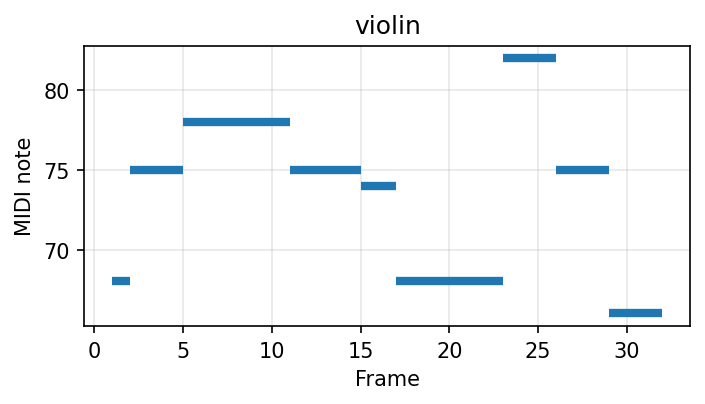
        <audio controls preload="none"><source src="assets/audio/conditional_synthesis/1.2k/1.2k_30_melody_sine.mp3" type="audio/mpeg"></audio>
      </td>
      <td>1</td>      
      <td><audio controls preload="none"><source src="assets/audio/conditional_synthesis/1.2k/1.2k_30_PLaTune-BDA_Ours_style2.mp3" type="audio/mpeg"></audio></td>
      <td><audio controls preload="none"><source src="assets/audio/conditional_synthesis/1.2k/1.2k_30_WavAug_no_BDA_style2.mp3" type="audio/mpeg"></audio></td>
      <td><audio controls preload="none"><source src="assets/audio/conditional_synthesis/1.2k/1.2k_30_PLaTune_Baseline_style2.mp3" type="audio/mpeg"></audio></td>
    </tr>
    <tr>
      <td>2</td>
      <td><audio controls preload="none"><source src="assets/audio/conditional_synthesis/1.2k/1.2k_30_PLaTune-BDA_Ours_style3.mp3" type="audio/mpeg"></audio></td>
      <td><audio controls preload="none"><source src="assets/audio/conditional_synthesis/1.2k/1.2k_30_WavAug_no_BDA_style3.mp3" type="audio/mpeg"></audio></td>
      <td><audio controls preload="none"><source src="assets/audio/conditional_synthesis/1.2k/1.2k_30_PLaTune_Baseline_style3.mp3" type="audio/mpeg"></audio></td>
    </tr>
    <tr>
      <td>3</td>
      <td><audio controls preload="none"><source src="assets/audio/conditional_synthesis/1.2k/1.2k_30_PLaTune-BDA_Ours_style5.mp3" type="audio/mpeg"></audio></td>
      <td><audio controls preload="none"><source src="assets/audio/conditional_synthesis/1.2k/1.2k_30_WavAug_no_BDA_style5.mp3" type="audio/mpeg"></audio></td>
      <td><audio controls preload="none"><source src="assets/audio/conditional_synthesis/1.2k/1.2k_30_PLaTune_Baseline_style5.mp3" type="audio/mpeg"></audio></td>
    </tr>
    <!-- Melody 33 -->
    <tr>
      <td rowspan="3">
        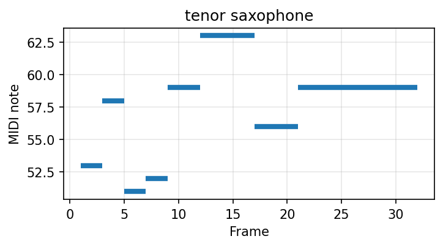
        <audio controls preload="none"><source src="assets/audio/conditional_synthesis/1.2k/1.2k_33_melody_sine.mp3" type="audio/mpeg"></audio>
      </td>
      <td>1</td>
      <td><audio controls preload="none"><source src="assets/audio/conditional_synthesis/1.2k/1.2k_33_PLaTune-BDA_Ours_style2.mp3" type="audio/mpeg"></audio></td>
      <td><audio controls preload="none"><source src="assets/audio/conditional_synthesis/1.2k/1.2k_33_WavAug_no_BDA_style2.mp3" type="audio/mpeg"></audio></td>
      <td><audio controls preload="none"><source src="assets/audio/conditional_synthesis/1.2k/1.2k_33_PLaTune_Baseline_style2.mp3" type="audio/mpeg"></audio></td>
    </tr>
    <tr>
      <td>2</td>
      <td><audio controls preload="none"><source src="assets/audio/conditional_synthesis/1.2k/1.2k_33_PLaTune-BDA_Ours_style3.mp3" type="audio/mpeg"></audio></td>
      <td><audio controls preload="none"><source src="assets/audio/conditional_synthesis/1.2k/1.2k_33_WavAug_no_BDA_style3.mp3" type="audio/mpeg"></audio></td>
      <td><audio controls preload="none"><source src="assets/audio/conditional_synthesis/1.2k/1.2k_33_PLaTune_Baseline_style3.mp3" type="audio/mpeg"></audio></td>
    </tr>
    <tr>
      <td>3</td>
      <td><audio controls preload="none"><source src="assets/audio/conditional_synthesis/1.2k/1.2k_33_PLaTune-BDA_Ours_style5.mp3" type="audio/mpeg"></audio></td>
      <td><audio controls preload="none"><source src="assets/audio/conditional_synthesis/1.2k/1.2k_33_WavAug_no_BDA_style5.mp3" type="audio/mpeg"></audio></td>
      <td><audio controls preload="none"><source src="assets/audio/conditional_synthesis/1.2k/1.2k_33_PLaTune_Baseline_style5.mp3" type="audio/mpeg"></audio></td>
    </tr>
    <!-- Melody 70 -->
    <tr>
      <td rowspan="3">
        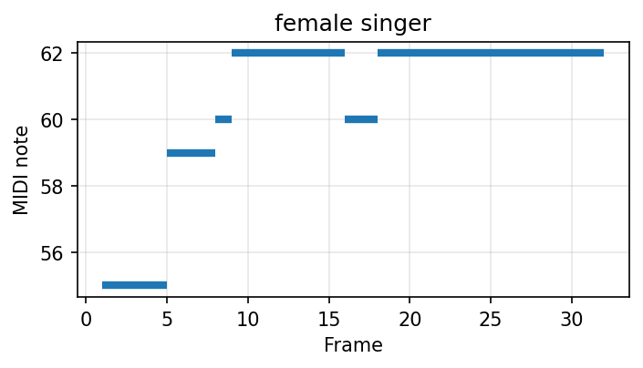
        <audio controls preload="none"><source src="assets/audio/conditional_synthesis/1.2k/1.2k_70_melody_sine.mp3" type="audio/mpeg"></audio>
      </td>
      <td>1</td>
      <td><audio controls preload="none"><source src="assets/audio/conditional_synthesis/1.2k/1.2k_70_PLaTune-BDA_Ours_style1.mp3" type="audio/mpeg"></audio></td>
      <td><audio controls preload="none"><source src="assets/audio/conditional_synthesis/1.2k/1.2k_70_WavAug_no_BDA_style1.mp3" type="audio/mpeg"></audio></td>
      <td><audio controls preload="none"><source src="assets/audio/conditional_synthesis/1.2k/1.2k_70_PLaTune_Baseline_style1.mp3" type="audio/mpeg"></audio></td>
    </tr>
    <tr>
      <td>2</td>
      <td><audio controls preload="none"><source src="assets/audio/conditional_synthesis/1.2k/1.2k_70_PLaTune-BDA_Ours_style3.mp3" type="audio/mpeg"></audio></td>
      <td><audio controls preload="none"><source src="assets/audio/conditional_synthesis/1.2k/1.2k_70_WavAug_no_BDA_style3.mp3" type="audio/mpeg"></audio></td>
      <td><audio controls preload="none"><source src="assets/audio/conditional_synthesis/1.2k/1.2k_70_PLaTune_Baseline_style3.mp3" type="audio/mpeg"></audio></td>
    </tr>
    <tr>
      <td>3</td>
      <td><audio controls preload="none"><source src="assets/audio/conditional_synthesis/1.2k/1.2k_70_PLaTune-BDA_Ours_style5.mp3" type="audio/mpeg"></audio></td>
      <td><audio controls preload="none"><source src="assets/audio/conditional_synthesis/1.2k/1.2k_70_WavAug_no_BDA_style5.mp3" type="audio/mpeg"></audio></td>
      <td><audio controls preload="none"><source src="assets/audio/conditional_synthesis/1.2k/1.2k_70_PLaTune_Baseline_style5.mp3" type="audio/mpeg"></audio></td>
    </tr>
    <!-- Melody 269 -->
    <tr>
      <td rowspan="3">
        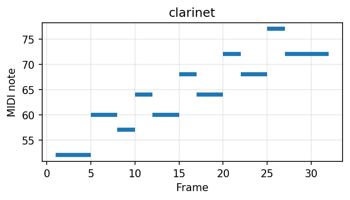
        <audio controls preload="none"><source src="assets/audio/conditional_synthesis/1.2k/1.2k_269_melody_sine.mp3" type="audio/mpeg"></audio>
      </td>
      <td>1</td>
      <td><audio controls preload="none"><source src="assets/audio/conditional_synthesis/1.2k/1.2k_269_PLaTune-BDA_Ours_style1.mp3" type="audio/mpeg"></audio></td>
      <td><audio controls preload="none"><source src="assets/audio/conditional_synthesis/1.2k/1.2k_269_WavAug_no_BDA_style1.mp3" type="audio/mpeg"></audio></td>
      <td><audio controls preload="none"><source src="assets/audio/conditional_synthesis/1.2k/1.2k_269_PLaTune_Baseline_style1.mp3" type="audio/mpeg"></audio></td>
    </tr>
    <tr>
      <td>2</td>
      <td><audio controls preload="none"><source src="assets/audio/conditional_synthesis/1.2k/1.2k_269_PLaTune-BDA_Ours_style2.mp3" type="audio/mpeg"></audio></td>
      <td><audio controls preload="none"><source src="assets/audio/conditional_synthesis/1.2k/1.2k_269_WavAug_no_BDA_style2.mp3" type="audio/mpeg"></audio></td>
      <td><audio controls preload="none"><source src="assets/audio/conditional_synthesis/1.2k/1.2k_269_PLaTune_Baseline_style2.mp3" type="audio/mpeg"></audio></td>
    </tr>
    <tr>
      <td>3</td>
      <td><audio controls preload="none"><source src="assets/audio/conditional_synthesis/1.2k/1.2k_269_PLaTune-BDA_Ours_style5.mp3" type="audio/mpeg"></audio></td>
      <td><audio controls preload="none"><source src="assets/audio/conditional_synthesis/1.2k/1.2k_269_WavAug_no_BDA_style5.mp3" type="audio/mpeg"></audio></td>
      <td><audio controls preload="none"><source src="assets/audio/conditional_synthesis/1.2k/1.2k_269_PLaTune_Baseline_style5.mp3" type="audio/mpeg"></audio></td>
    </tr>
  </tbody>
</table>

#### 🟡 Training Set Size: 4.8k (~4h)

<table class="audio-table">
  <thead>
    <tr>
      <th>Melody</th>
      <th>Style</th>
      <th>PLaTune-BDA (Ours)</th>
      <th>WavAug (no BDA)</th>
      <th>PLaTune (Baseline)</th>
    </tr>
  </thead>
  <tbody>
    <!-- Melody 0 -->
    <tr>
      <td rowspan="3">
        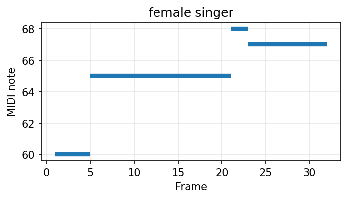
        <audio controls preload="none"><source src="assets/audio/conditional_synthesis/4.8k/4.8k_0_melody_sine.mp3" type="audio/mpeg"></audio>
      </td>
      <td>1</td>
      <td><audio controls preload="none"><source src="assets/audio/conditional_synthesis/4.8k/4.8k_0_PLaTune-BDA_Ours_style1.mp3" type="audio/mpeg"></audio></td>
      <td><audio controls preload="none"><source src="assets/audio/conditional_synthesis/4.8k/4.8k_0_WavAug_no_BDA_style1.mp3" type="audio/mpeg"></audio></td>
      <td><audio controls preload="none"><source src="assets/audio/conditional_synthesis/4.8k/4.8k_0_PLaTune_Baseline_style1.mp3" type="audio/mpeg"></audio></td>
    </tr>
    <tr>
      <td>2</td>
      <td><audio controls preload="none"><source src="assets/audio/conditional_synthesis/4.8k/4.8k_0_PLaTune-BDA_Ours_style2.mp3" type="audio/mpeg"></audio></td>
      <td><audio controls preload="none"><source src="assets/audio/conditional_synthesis/4.8k/4.8k_0_WavAug_no_BDA_style2.mp3" type="audio/mpeg"></audio></td>
      <td><audio controls preload="none"><source src="assets/audio/conditional_synthesis/4.8k/4.8k_0_PLaTune_Baseline_style2.mp3" type="audio/mpeg"></audio></td>
    </tr>
    <tr>
      <td>3</td>
      <td><audio controls preload="none"><source src="assets/audio/conditional_synthesis/4.8k/4.8k_0_PLaTune-BDA_Ours_style4.mp3" type="audio/mpeg"></audio></td>
      <td><audio controls preload="none"><source src="assets/audio/conditional_synthesis/4.8k/4.8k_0_WavAug_no_BDA_style4.mp3" type="audio/mpeg"></audio></td>
      <td><audio controls preload="none"><source src="assets/audio/conditional_synthesis/4.8k/4.8k_0_PLaTune_Baseline_style4.mp3" type="audio/mpeg"></audio></td>
    </tr>
    <!-- Melody 2 -->
    <tr>
      <td rowspan="3">
        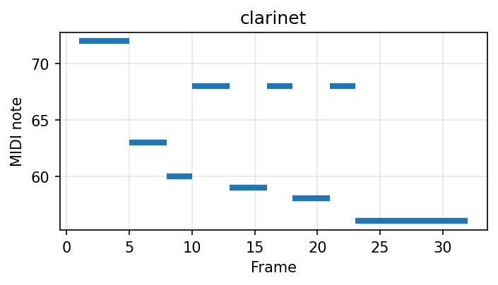
        <audio controls preload="none"><source src="assets/audio/conditional_synthesis/4.8k/4.8k_2_melody_sine.mp3" type="audio/mpeg"></audio>
      </td>
      <td>1</td>
      <td><audio controls preload="none"><source src="assets/audio/conditional_synthesis/4.8k/4.8k_2_PLaTune-BDA_Ours_style1.mp3" type="audio/mpeg"></audio></td>
      <td><audio controls preload="none"><source src="assets/audio/conditional_synthesis/4.8k/4.8k_2_WavAug_no_BDA_style1.mp3" type="audio/mpeg"></audio></td>
      <td><audio controls preload="none"><source src="assets/audio/conditional_synthesis/4.8k/4.8k_2_PLaTune_Baseline_style1.mp3" type="audio/mpeg"></audio></td>
    </tr>
    <tr>
      <td>2</td>
      <td><audio controls preload="none"><source src="assets/audio/conditional_synthesis/4.8k/4.8k_2_PLaTune-BDA_Ours_style3.mp3" type="audio/mpeg"></audio></td>
      <td><audio controls preload="none"><source src="assets/audio/conditional_synthesis/4.8k/4.8k_2_WavAug_no_BDA_style3.mp3" type="audio/mpeg"></audio></td>
      <td><audio controls preload="none"><source src="assets/audio/conditional_synthesis/4.8k/4.8k_2_PLaTune_Baseline_style3.mp3" type="audio/mpeg"></audio></td>
    </tr>
    <tr>
      <td>3</td>
      <td><audio controls preload="none"><source src="assets/audio/conditional_synthesis/4.8k/4.8k_2_PLaTune-BDA_Ours_style4.mp3" type="audio/mpeg"></audio></td>
      <td><audio controls preload="none"><source src="assets/audio/conditional_synthesis/4.8k/4.8k_2_WavAug_no_BDA_style4.mp3" type="audio/mpeg"></audio></td>
      <td><audio controls preload="none"><source src="assets/audio/conditional_synthesis/4.8k/4.8k_2_PLaTune_Baseline_style4.mp3" type="audio/mpeg"></audio></td>
    </tr>
    <!-- Melody 34 -->
    <tr>
      <td rowspan="3">
        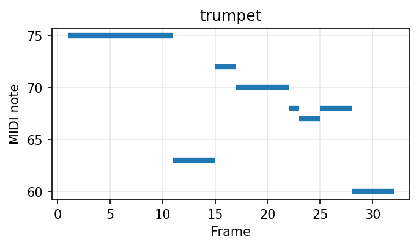
        <audio controls preload="none"><source src="assets/audio/conditional_synthesis/4.8k/4.8k_34_melody_sine.mp3" type="audio/mpeg"></audio>
      </td>
      <td>1</td>
      <td><audio controls preload="none"><source src="assets/audio/conditional_synthesis/4.8k/4.8k_34_PLaTune-BDA_Ours_style1.mp3" type="audio/mpeg"></audio></td>
      <td><audio controls preload="none"><source src="assets/audio/conditional_synthesis/4.8k/4.8k_34_WavAug_no_BDA_style1.mp3" type="audio/mpeg"></audio></td>
      <td><audio controls preload="none"><source src="assets/audio/conditional_synthesis/4.8k/4.8k_34_PLaTune_Baseline_style1.mp3" type="audio/mpeg"></audio></td>
    </tr>
    <tr>
      <td>2</td>
      <td><audio controls preload="none"><source src="assets/audio/conditional_synthesis/4.8k/4.8k_34_PLaTune-BDA_Ours_style3.mp3" type="audio/mpeg"></audio></td>
      <td><audio controls preload="none"><source src="assets/audio/conditional_synthesis/4.8k/4.8k_34_WavAug_no_BDA_style3.mp3" type="audio/mpeg"></audio></td>
      <td><audio controls preload="none"><source src="assets/audio/conditional_synthesis/4.8k/4.8k_34_PLaTune_Baseline_style3.mp3" type="audio/mpeg"></audio></td>
    </tr>
    <tr>
      <td>3</td>
      <td><audio controls preload="none"><source src="assets/audio/conditional_synthesis/4.8k/4.8k_34_PLaTune-BDA_Ours_style5.mp3" type="audio/mpeg"></audio></td>
      <td><audio controls preload="none"><source src="assets/audio/conditional_synthesis/4.8k/4.8k_34_WavAug_no_BDA_style5.mp3" type="audio/mpeg"></audio></td>
      <td><audio controls preload="none"><source src="assets/audio/conditional_synthesis/4.8k/4.8k_34_PLaTune_Baseline_style5.mp3" type="audio/mpeg"></audio></td>
    </tr>
    <!-- Melody 42 -->
    <tr>
      <td rowspan="3">
        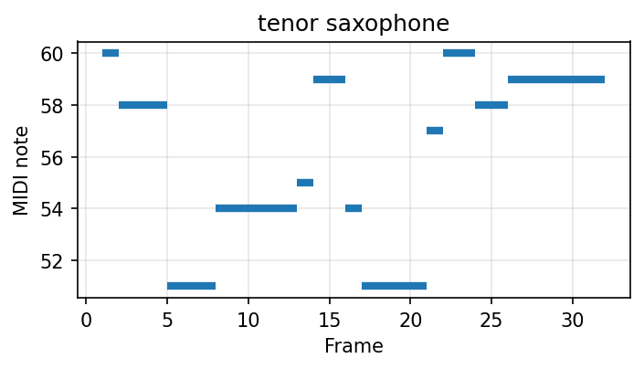
        <audio controls preload="none"><source src="assets/audio/conditional_synthesis/4.8k/4.8k_42_melody_sine.mp3" type="audio/mpeg"></audio>
      </td>
      <td>1</td>
      <td><audio controls preload="none"><source src="assets/audio/conditional_synthesis/4.8k/4.8k_42_PLaTune-BDA_Ours_style1.mp3" type="audio/mpeg"></audio></td>
      <td><audio controls preload="none"><source src="assets/audio/conditional_synthesis/4.8k/4.8k_42_WavAug_no_BDA_style1.mp3" type="audio/mpeg"></audio></td>
      <td><audio controls preload="none"><source src="assets/audio/conditional_synthesis/4.8k/4.8k_42_PLaTune_Baseline_style1.mp3" type="audio/mpeg"></audio></td>
    </tr>
    <tr>
      <td>2</td>
      <td><audio controls preload="none"><source src="assets/audio/conditional_synthesis/4.8k/4.8k_42_PLaTune-BDA_Ours_style2.mp3" type="audio/mpeg"></audio></td>
      <td><audio controls preload="none"><source src="assets/audio/conditional_synthesis/4.8k/4.8k_42_WavAug_no_BDA_style2.mp3" type="audio/mpeg"></audio></td>
      <td><audio controls preload="none"><source src="assets/audio/conditional_synthesis/4.8k/4.8k_42_PLaTune_Baseline_style2.mp3" type="audio/mpeg"></audio></td>
    </tr>
    <tr>
      <td>3</td>
      <td><audio controls preload="none"><source src="assets/audio/conditional_synthesis/4.8k/4.8k_42_PLaTune-BDA_Ours_style5.mp3" type="audio/mpeg"></audio></td>
      <td><audio controls preload="none"><source src="assets/audio/conditional_synthesis/4.8k/4.8k_42_WavAug_no_BDA_style5.mp3" type="audio/mpeg"></audio></td>
      <td><audio controls preload="none"><source src="assets/audio/conditional_synthesis/4.8k/4.8k_42_PLaTune_Baseline_style5.mp3" type="audio/mpeg"></audio></td>
    </tr>
    <!-- Melody 66 -->
    <tr>
      <td rowspan="3">
        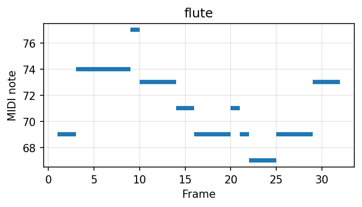
        <audio controls preload="none"><source src="assets/audio/conditional_synthesis/4.8k/4.8k_66_melody_sine.mp3" type="audio/mpeg"></audio>
      </td>
      <td>1</td>
      <td><audio controls preload="none"><source src="assets/audio/conditional_synthesis/4.8k/4.8k_66_PLaTune-BDA_Ours_style1.mp3" type="audio/mpeg"></audio></td>
      <td><audio controls preload="none"><source src="assets/audio/conditional_synthesis/4.8k/4.8k_66_WavAug_no_BDA_style1.mp3" type="audio/mpeg"></audio></td>
      <td><audio controls preload="none"><source src="assets/audio/conditional_synthesis/4.8k/4.8k_66_PLaTune_Baseline_style1.mp3" type="audio/mpeg"></audio></td>
    </tr>
    <tr>
      <td>2</td>
      <td><audio controls preload="none"><source src="assets/audio/conditional_synthesis/4.8k/4.8k_66_PLaTune-BDA_Ours_style2.mp3" type="audio/mpeg"></audio></td>
      <td><audio controls preload="none"><source src="assets/audio/conditional_synthesis/4.8k/4.8k_66_WavAug_no_BDA_style2.mp3" type="audio/mpeg"></audio></td>
      <td><audio controls preload="none"><source src="assets/audio/conditional_synthesis/4.8k/4.8k_66_PLaTune_Baseline_style2.mp3" type="audio/mpeg"></audio></td>
    </tr>
    <tr>
      <td>3</td>
      <td><audio controls preload="none"><source src="assets/audio/conditional_synthesis/4.8k/4.8k_66_PLaTune-BDA_Ours_style5.mp3" type="audio/mpeg"></audio></td>
      <td><audio controls preload="none"><source src="assets/audio/conditional_synthesis/4.8k/4.8k_66_WavAug_no_BDA_style5.mp3" type="audio/mpeg"></audio></td>
      <td><audio controls preload="none"><source src="assets/audio/conditional_synthesis/4.8k/4.8k_66_PLaTune_Baseline_style5.mp3" type="audio/mpeg"></audio></td>
    </tr>
    <!-- Melody 68 -->
    <tr>
      <td rowspan="3">
        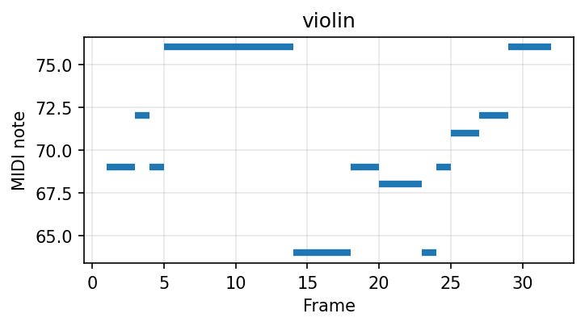
        <audio controls preload="none"><source src="assets/audio/conditional_synthesis/4.8k/4.8k_68_melody_sine.mp3" type="audio/mpeg"></audio>
      </td>
      <td>1</td>
      <td><audio controls preload="none"><source src="assets/audio/conditional_synthesis/4.8k/4.8k_68_PLaTune-BDA_Ours_style2.mp3" type="audio/mpeg"></audio></td>
      <td><audio controls preload="none"><source src="assets/audio/conditional_synthesis/4.8k/4.8k_68_WavAug_no_BDA_style2.mp3" type="audio/mpeg"></audio></td>
      <td><audio controls preload="none"><source src="assets/audio/conditional_synthesis/4.8k/4.8k_68_PLaTune_Baseline_style2.mp3" type="audio/mpeg"></audio></td>
    </tr>
    <tr>
      <td>2</td>
      <td><audio controls preload="none"><source src="assets/audio/conditional_synthesis/4.8k/4.8k_68_PLaTune-BDA_Ours_style3.mp3" type="audio/mpeg"></audio></td>
      <td><audio controls preload="none"><source src="assets/audio/conditional_synthesis/4.8k/4.8k_68_WavAug_no_BDA_style3.mp3" type="audio/mpeg"></audio></td>
      <td><audio controls preload="none"><source src="assets/audio/conditional_synthesis/4.8k/4.8k_68_PLaTune_Baseline_style3.mp3" type="audio/mpeg"></audio></td>
    </tr>
    <tr>
      <td>3</td>
      <td><audio controls preload="none"><source src="assets/audio/conditional_synthesis/4.8k/4.8k_68_PLaTune-BDA_Ours_style5.mp3" type="audio/mpeg"></audio></td>
      <td><audio controls preload="none"><source src="assets/audio/conditional_synthesis/4.8k/4.8k_68_WavAug_no_BDA_style5.mp3" type="audio/mpeg"></audio></td>
      <td><audio controls preload="none"><source src="assets/audio/conditional_synthesis/4.8k/4.8k_68_PLaTune_Baseline_style5.mp3" type="audio/mpeg"></audio></td>
    </tr>
  </tbody>
</table>

#### 🟢 Training Set Size: 19.2k (~16h)

<table class="audio-table">
  <thead>
    <tr>
      <th>Melody</th>
      <th>Style</th>
      <th>PLaTune-BDA (Ours)</th>
      <th>WavAug (no BDA)</th>
      <th>PLaTune (Baseline)</th>
    </tr>
  </thead>
  <tbody>
    <!-- Melody 74 -->
    <tr>
      <td rowspan="3">
        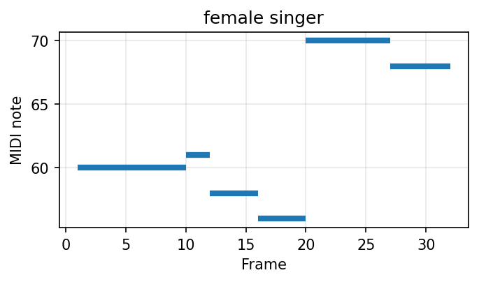
        <audio controls preload="none"><source src="assets/audio/conditional_synthesis/19.2k/19.2k_74_melody_sine.mp3" type="audio/mpeg"></audio>
      </td>
      <td>1</td>
      <td><audio controls preload="none"><source src="assets/audio/conditional_synthesis/19.2k/19.2k_74_PLaTune-BDA_Ours_style1.mp3" type="audio/mpeg"></audio></td>
      <td><audio controls preload="none"><source src="assets/audio/conditional_synthesis/19.2k/19.2k_74_WavAug_no_BDA_style1.mp3" type="audio/mpeg"></audio></td>
      <td><audio controls preload="none"><source src="assets/audio/conditional_synthesis/19.2k/19.2k_74_PLaTune_Baseline_style1.mp3" type="audio/mpeg"></audio></td>
    </tr>
    <tr>
      <td>2</td>
      <td><audio controls preload="none"><source src="assets/audio/conditional_synthesis/19.2k/19.2k_74_PLaTune-BDA_Ours_style2.mp3" type="audio/mpeg"></audio></td>
      <td><audio controls preload="none"><source src="assets/audio/conditional_synthesis/19.2k/19.2k_74_WavAug_no_BDA_style2.mp3" type="audio/mpeg"></audio></td>
      <td><audio controls preload="none"><source src="assets/audio/conditional_synthesis/19.2k/19.2k_74_PLaTune_Baseline_style2.mp3" type="audio/mpeg"></audio></td>
    </tr>
    <tr>
      <td>3</td>
      <td><audio controls preload="none"><source src="assets/audio/conditional_synthesis/19.2k/19.2k_74_PLaTune-BDA_Ours_style3.mp3" type="audio/mpeg"></audio></td>
      <td><audio controls preload="none"><source src="assets/audio/conditional_synthesis/19.2k/19.2k_74_WavAug_no_BDA_style3.mp3" type="audio/mpeg"></audio></td>
      <td><audio controls preload="none"><source src="assets/audio/conditional_synthesis/19.2k/19.2k_74_PLaTune_Baseline_style3.mp3" type="audio/mpeg"></audio></td>
    </tr>
    <!-- Melody 77 -->
    <tr>
      <td rowspan="3">
        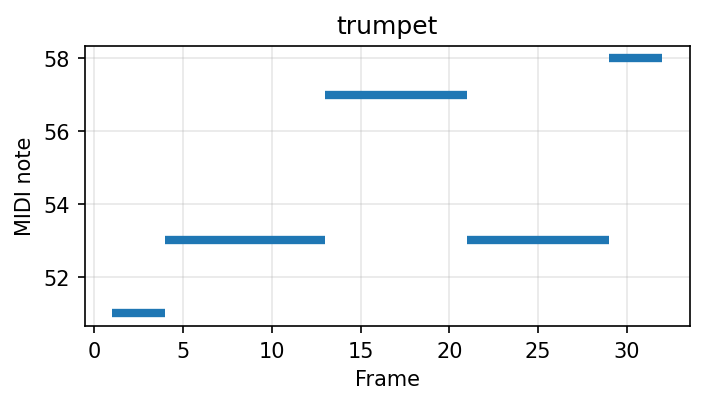
        <audio controls preload="none"><source src="assets/audio/conditional_synthesis/19.2k/19.2k_77_melody_sine.mp3" type="audio/mpeg"></audio>
      </td>
      <td>1</td>
      <td><audio controls preload="none"><source src="assets/audio/conditional_synthesis/19.2k/19.2k_77_PLaTune-BDA_Ours_style1.mp3" type="audio/mpeg"></audio></td>
      <td><audio controls preload="none"><source src="assets/audio/conditional_synthesis/19.2k/19.2k_77_WavAug_no_BDA_style1.mp3" type="audio/mpeg"></audio></td>
      <td><audio controls preload="none"><source src="assets/audio/conditional_synthesis/19.2k/19.2k_77_PLaTune_Baseline_style1.mp3" type="audio/mpeg"></audio></td>
    </tr>
    <tr>
      <td>2</td>
      <td><audio controls preload="none"><source src="assets/audio/conditional_synthesis/19.2k/19.2k_77_PLaTune-BDA_Ours_style3.mp3" type="audio/mpeg"></audio></td>
      <td><audio controls preload="none"><source src="assets/audio/conditional_synthesis/19.2k/19.2k_77_WavAug_no_BDA_style3.mp3" type="audio/mpeg"></audio></td>
      <td><audio controls preload="none"><source src="assets/audio/conditional_synthesis/19.2k/19.2k_77_PLaTune_Baseline_style3.mp3" type="audio/mpeg"></audio></td>
    </tr>
    <tr>
      <td>3</td>
      <td><audio controls preload="none"><source src="assets/audio/conditional_synthesis/19.2k/19.2k_77_PLaTune-BDA_Ours_style5.mp3" type="audio/mpeg"></audio></td>
      <td><audio controls preload="none"><source src="assets/audio/conditional_synthesis/19.2k/19.2k_77_WavAug_no_BDA_style5.mp3" type="audio/mpeg"></audio></td>
      <td><audio controls preload="none"><source src="assets/audio/conditional_synthesis/19.2k/19.2k_77_PLaTune_Baseline_style5.mp3" type="audio/mpeg"></audio></td>
    </tr>
    <!-- Melody 87 -->
    <tr>
      <td rowspan="3">
        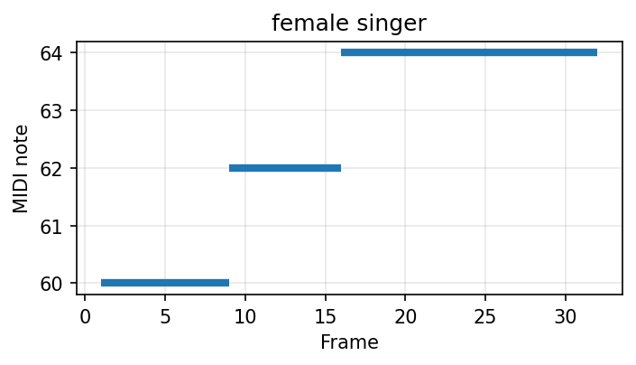
        <audio controls preload="none"><source src="assets/audio/conditional_synthesis/19.2k/19.2k_87_melody_sine.mp3" type="audio/mpeg"></audio>
      </td>
      <td>1</td>
      <td><audio controls preload="none"><source src="assets/audio/conditional_synthesis/19.2k/19.2k_87_PLaTune-BDA_Ours_style1.mp3" type="audio/mpeg"></audio></td>
      <td><audio controls preload="none"><source src="assets/audio/conditional_synthesis/19.2k/19.2k_87_WavAug_no_BDA_style1.mp3" type="audio/mpeg"></audio></td>
      <td><audio controls preload="none"><source src="assets/audio/conditional_synthesis/19.2k/19.2k_87_PLaTune_Baseline_style1.mp3" type="audio/mpeg"></audio></td>
    </tr>
    <tr>
      <td>2</td>
      <td><audio controls preload="none"><source src="assets/audio/conditional_synthesis/19.2k/19.2k_87_PLaTune-BDA_Ours_style2.mp3" type="audio/mpeg"></audio></td>
      <td><audio controls preload="none"><source src="assets/audio/conditional_synthesis/19.2k/19.2k_87_WavAug_no_BDA_style2.mp3" type="audio/mpeg"></audio></td>
      <td><audio controls preload="none"><source src="assets/audio/conditional_synthesis/19.2k/19.2k_87_PLaTune_Baseline_style2.mp3" type="audio/mpeg"></audio></td>
    </tr>
    <tr>
      <td>3</td>
      <td><audio controls preload="none"><source src="assets/audio/conditional_synthesis/19.2k/19.2k_87_PLaTune-BDA_Ours_style5.mp3" type="audio/mpeg"></audio></td>
      <td><audio controls preload="none"><source src="assets/audio/conditional_synthesis/19.2k/19.2k_87_WavAug_no_BDA_style5.mp3" type="audio/mpeg"></audio></td>
      <td><audio controls preload="none"><source src="assets/audio/conditional_synthesis/19.2k/19.2k_87_PLaTune_Baseline_style5.mp3" type="audio/mpeg"></audio></td>
    </tr>
    <!-- Melody 96 -->
    <tr>
      <td rowspan="3">
        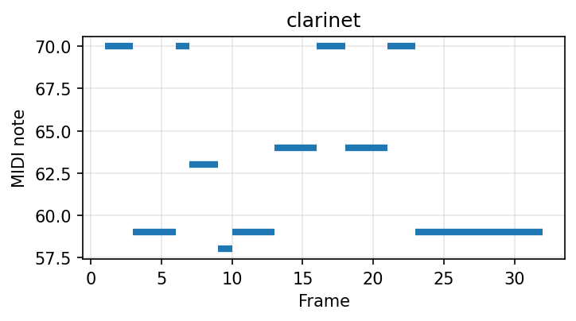
        <audio controls preload="none"><source src="assets/audio/conditional_synthesis/19.2k/19.2k_96_melody_sine.mp3" type="audio/mpeg"></audio>
      </td>
      <td>1</td>
      <td><audio controls preload="none"><source src="assets/audio/conditional_synthesis/19.2k/19.2k_96_PLaTune-BDA_Ours_style1.mp3" type="audio/mpeg"></audio></td>
      <td><audio controls preload="none"><source src="assets/audio/conditional_synthesis/19.2k/19.2k_96_WavAug_no_BDA_style1.mp3" type="audio/mpeg"></audio></td>
      <td><audio controls preload="none"><source src="assets/audio/conditional_synthesis/19.2k/19.2k_96_PLaTune_Baseline_style1.mp3" type="audio/mpeg"></audio></td>
    </tr>
    <tr>
      <td>2</td>
      <td><audio controls preload="none"><source src="assets/audio/conditional_synthesis/19.2k/19.2k_96_PLaTune-BDA_Ours_style3.mp3" type="audio/mpeg"></audio></td>
      <td><audio controls preload="none"><source src="assets/audio/conditional_synthesis/19.2k/19.2k_96_WavAug_no_BDA_style3.mp3" type="audio/mpeg"></audio></td>
      <td><audio controls preload="none"><source src="assets/audio/conditional_synthesis/19.2k/19.2k_96_PLaTune_Baseline_style3.mp3" type="audio/mpeg"></audio></td>
    </tr>
    <tr>
      <td>3</td>
      <td><audio controls preload="none"><source src="assets/audio/conditional_synthesis/19.2k/19.2k_96_PLaTune-BDA_Ours_style4.mp3" type="audio/mpeg"></audio></td>
      <td><audio controls preload="none"><source src="assets/audio/conditional_synthesis/19.2k/19.2k_96_WavAug_no_BDA_style4.mp3" type="audio/mpeg"></audio></td>
      <td><audio controls preload="none"><source src="assets/audio/conditional_synthesis/19.2k/19.2k_96_PLaTune_Baseline_style4.mp3" type="audio/mpeg"></audio></td>
    </tr>
    <!-- Melody 103 -->
    <tr>
      <td rowspan="3">
        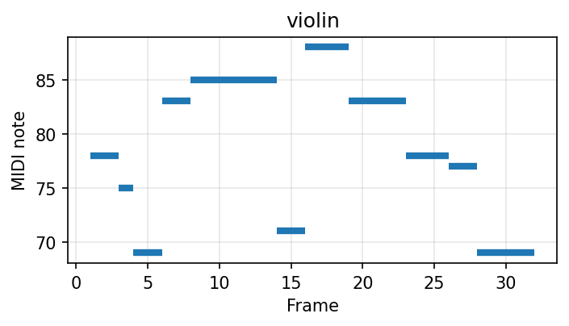
        <audio controls preload="none"><source src="assets/audio/conditional_synthesis/19.2k/19.2k_103_melody_sine.mp3" type="audio/mpeg"></audio>
      </td>
      <td>1</td>
      <td><audio controls preload="none"><source src="assets/audio/conditional_synthesis/19.2k/19.2k_103_PLaTune-BDA_Ours_style2.mp3" type="audio/mpeg"></audio></td>
      <td><audio controls preload="none"><source src="assets/audio/conditional_synthesis/19.2k/19.2k_103_WavAug_no_BDA_style2.mp3" type="audio/mpeg"></audio></td>
      <td><audio controls preload="none"><source src="assets/audio/conditional_synthesis/19.2k/19.2k_103_PLaTune_Baseline_style2.mp3" type="audio/mpeg"></audio></td>
    </tr>
    <tr>
      <td>2</td>
      <td><audio controls preload="none"><source src="assets/audio/conditional_synthesis/19.2k/19.2k_103_PLaTune-BDA_Ours_style3.mp3" type="audio/mpeg"></audio></td>
      <td><audio controls preload="none"><source src="assets/audio/conditional_synthesis/19.2k/19.2k_103_WavAug_no_BDA_style3.mp3" type="audio/mpeg"></audio></td>
      <td><audio controls preload="none"><source src="assets/audio/conditional_synthesis/19.2k/19.2k_103_PLaTune_Baseline_style3.mp3" type="audio/mpeg"></audio></td>
    </tr>
    <tr>
      <td>3</td>
      <td><audio controls preload="none"><source src="assets/audio/conditional_synthesis/19.2k/19.2k_103_PLaTune-BDA_Ours_style5.mp3" type="audio/mpeg"></audio></td>
      <td><audio controls preload="none"><source src="assets/audio/conditional_synthesis/19.2k/19.2k_103_WavAug_no_BDA_style5.mp3" type="audio/mpeg"></audio></td>
      <td><audio controls preload="none"><source src="assets/audio/conditional_synthesis/19.2k/19.2k_103_PLaTune_Baseline_style5.mp3" type="audio/mpeg"></audio></td>
    </tr>
    <!-- Melody 107 -->
    <tr>
      <td rowspan="3">
        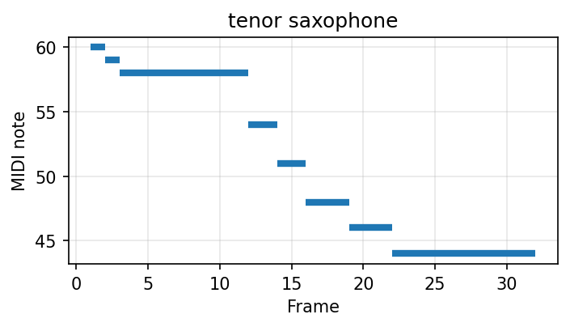
        <audio controls preload="none"><source src="assets/audio/conditional_synthesis/19.2k/19.2k_107_melody_sine.mp3" type="audio/mpeg"></audio>
      </td>
      <td>1</td>
      <td><audio controls preload="none"><source src="assets/audio/conditional_synthesis/19.2k/19.2k_107_PLaTune-BDA_Ours_style1.mp3" type="audio/mpeg"></audio></td>
      <td><audio controls preload="none"><source src="assets/audio/conditional_synthesis/19.2k/19.2k_107_WavAug_no_BDA_style1.mp3" type="audio/mpeg"></audio></td>
      <td><audio controls preload="none"><source src="assets/audio/conditional_synthesis/19.2k/19.2k_107_PLaTune_Baseline_style1.mp3" type="audio/mpeg"></audio></td>
    </tr>
    <tr>
      <td>2</td>
      <td><audio controls preload="none"><source src="assets/audio/conditional_synthesis/19.2k/19.2k_107_PLaTune-BDA_Ours_style2.mp3" type="audio/mpeg"></audio></td>
      <td><audio controls preload="none"><source src="assets/audio/conditional_synthesis/19.2k/19.2k_107_WavAug_no_BDA_style2.mp3" type="audio/mpeg"></audio></td>
      <td><audio controls preload="none"><source src="assets/audio/conditional_synthesis/19.2k/19.2k_107_PLaTune_Baseline_style2.mp3" type="audio/mpeg"></audio></td>
    </tr>
    <tr>
      <td>3</td>
      <td><audio controls preload="none"><source src="assets/audio/conditional_synthesis/19.2k/19.2k_107_PLaTune-BDA_Ours_style5.mp3" type="audio/mpeg"></audio></td>
      <td><audio controls preload="none"><source src="assets/audio/conditional_synthesis/19.2k/19.2k_107_WavAug_no_BDA_style5.mp3" type="audio/mpeg"></audio></td>
      <td><audio controls preload="none"><source src="assets/audio/conditional_synthesis/19.2k/19.2k_107_PLaTune_Baseline_style5.mp3" type="audio/mpeg"></audio></td>
    </tr>
  </tbody>
</table>

## Experiment 4: A Regional Small Dataset  

We explore our method on CCOM-HuQin (Zhang et al., 2023), an open dataset of a family of traditional Chinese bowed string instruments HuQin (胡琴). We use a 1h subset for training and the rest for evaluation. Each synthesis example conditions on both a melody contour and two playing-technique (PT) patterns.

### Conditional Synthesis

<table class="audio-table ccom-table">
  <colgroup>
    <col class="melody-col">
    <col class="pt-col">
    <col class="model-col">
    <col class="model-col">
  </colgroup>
  <thead>
    <tr>
      <th>Melody Condition</th>
      <th>PT Condition</th>
      <th>PLaTune-BDA (Ours)</th>
      <th>PLaTune (Baseline)</th>
    </tr>
  </thead>
  <tbody>
  <!-- Pair 34_0 -->
    <tr>
      <td rowspan="2">
        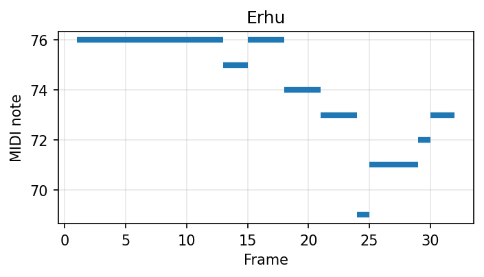
        <audio controls preload="none"><source src="assets/audio/ccom-huqin/ccom_34_0_melody_sine.mp3" type="audio/mpeg"></audio>
      </td>
      <td>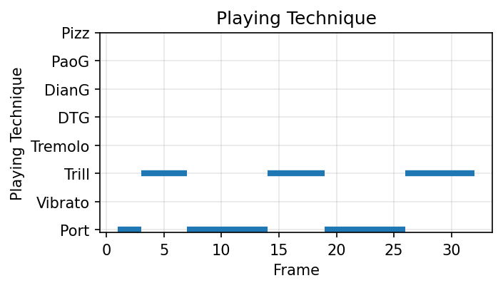</td>
      <td><audio controls preload="none"><source src="assets/audio/ccom-huqin/ccom_34_0_PLaTune-BDA_Ours_style1.mp3" type="audio/mpeg"></audio></td>
      <td><audio controls preload="none"><source src="assets/audio/ccom-huqin/ccom_34_0_PLaTune_Baseline_style1.mp3" type="audio/mpeg"></audio></td>
    </tr>
    <!-- Pair 34_34 -->
    <tr>
      <td>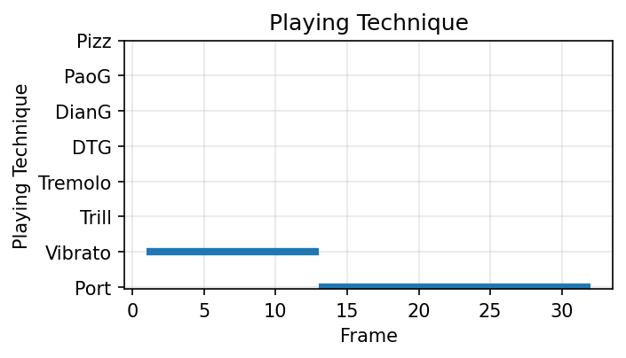</td>
      <td><audio controls preload="none"><source src="assets/audio/ccom-huqin/ccom_34_34_PLaTune-BDA_Ours_style1.mp3" type="audio/mpeg"></audio></td>
      <td><audio controls preload="none"><source src="assets/audio/ccom-huqin/ccom_34_34_PLaTune_Baseline_style1.mp3" type="audio/mpeg"></audio></td>
    </tr>
      <!-- Pair 69_69 -->
    <tr>
      <td rowspan="2">
        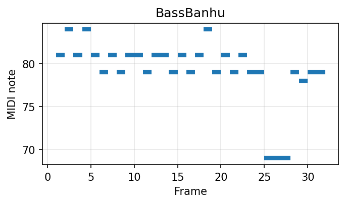
        <audio controls preload="none"><source src="assets/audio/ccom-huqin/ccom_69_69_melody_sine.mp3" type="audio/mpeg"></audio>
      </td>
      <td>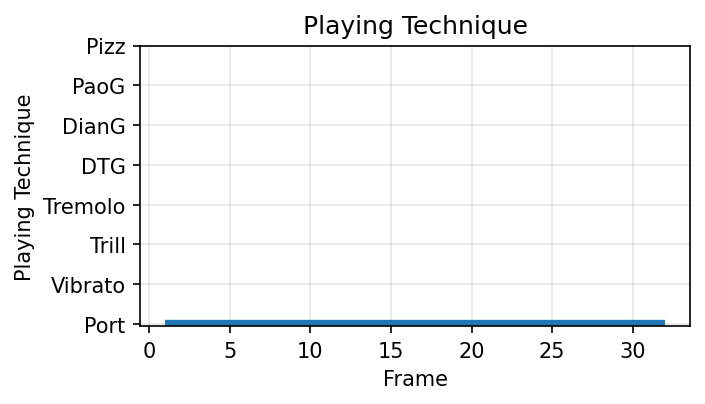</td>
      <td><audio controls preload="none"><source src="assets/audio/ccom-huqin/ccom_69_69_PLaTune-BDA_Ours_style1.mp3" type="audio/mpeg"></audio></td>
      <td><audio controls preload="none"><source src="assets/audio/ccom-huqin/ccom_69_69_PLaTune_Baseline_style1.mp3" type="audio/mpeg"></audio></td>
    </tr>
    <!-- Pair 69_72 -->
    <tr>
      <td>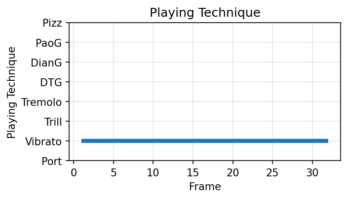</td>
      <td><audio controls preload="none"><source src="assets/audio/ccom-huqin/ccom_69_72_PLaTune-BDA_Ours_style1.mp3" type="audio/mpeg"></audio></td>
      <td><audio controls preload="none"><source src="assets/audio/ccom-huqin/ccom_69_72_PLaTune_Baseline_style1.mp3" type="audio/mpeg"></audio></td>
    </tr>
    <!-- Pair 71_71 -->
    <tr>
      <td rowspan="2">
        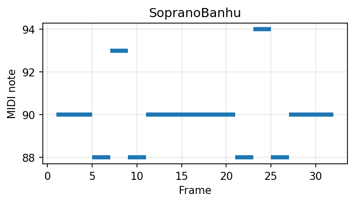
        <audio controls preload="none"><source src="assets/audio/ccom-huqin/ccom_71_71_melody_sine.mp3" type="audio/mpeg"></audio>
      </td>
      <td>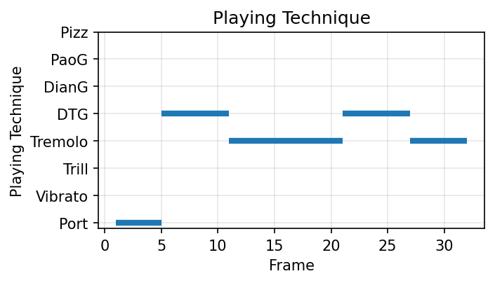</td>
      <td><audio controls preload="none"><source src="assets/audio/ccom-huqin/ccom_71_71_PLaTune-BDA_Ours_style1.mp3" type="audio/mpeg"></audio></td>
      <td><audio controls preload="none"><source src="assets/audio/ccom-huqin/ccom_71_71_PLaTune_Baseline_style1.mp3" type="audio/mpeg"></audio></td>
    </tr>
    <!-- Pair 71_77 -->
    <tr>
      <td>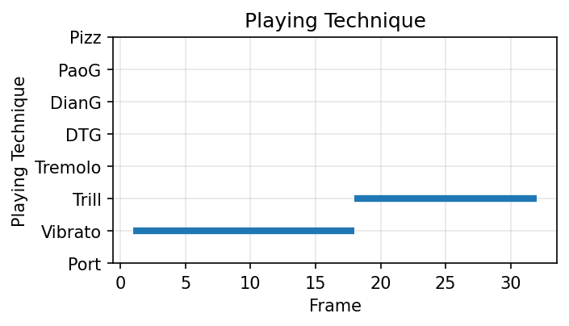</td>
      <td><audio controls preload="none"><source src="assets/audio/ccom-huqin/ccom_71_77_PLaTune-BDA_Ours_style1.mp3" type="audio/mpeg"></audio></td>
      <td><audio controls preload="none"><source src="assets/audio/ccom-huqin/ccom_71_77_PLaTune_Baseline_style1.mp3" type="audio/mpeg"></audio></td>
    </tr>
    <!-- Pair 14_12 -->
    <tr>
      <td rowspan="2">
        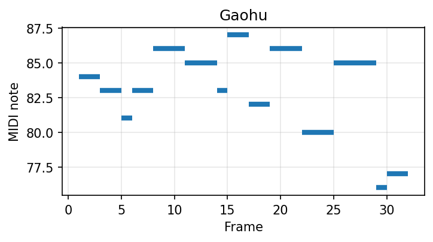
        <audio controls preload="none"><source src="assets/audio/ccom-huqin/ccom_14_12_melody_sine.mp3" type="audio/mpeg"></audio>
      </td>
      <td>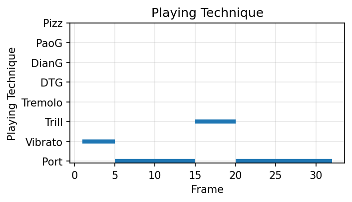</td>
      <td><audio controls preload="none"><source src="assets/audio/ccom-huqin/ccom_14_12_PLaTune-BDA_Ours_style1.mp3" type="audio/mpeg"></audio></td>
      <td><audio controls preload="none"><source src="assets/audio/ccom-huqin/ccom_14_12_PLaTune_Baseline_style1.mp3" type="audio/mpeg"></audio></td>
    </tr>
    <!-- Pair 14_14 -->
    <tr>
      <td></td>
      <td><audio controls preload="none"><source src="assets/audio/ccom-huqin/ccom_14_14_PLaTune-BDA_Ours_style1.mp3" type="audio/mpeg"></audio></td>
      <td><audio controls preload="none"><source src="assets/audio/ccom-huqin/ccom_14_14_PLaTune_Baseline_style1.mp3" type="audio/mpeg"></audio></td>
    </tr>
    <!-- Pair 31_14 -->
    <tr>
      <td rowspan="2">
        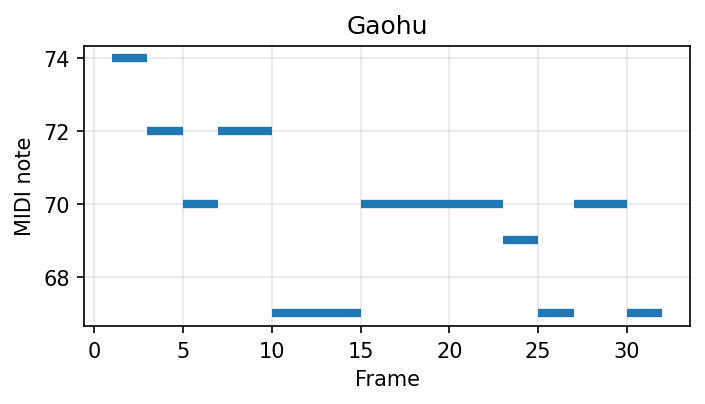
        <audio controls preload="none"><source src="assets/audio/ccom-huqin/ccom_31_14_melody_sine.mp3" type="audio/mpeg"></audio>
      </td>
      <td>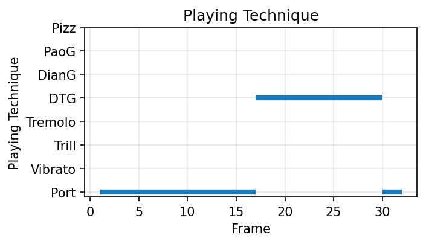</td>
      <td><audio controls preload="none"><source src="assets/audio/ccom-huqin/ccom_31_14_PLaTune-BDA_Ours_style1.mp3" type="audio/mpeg"></audio></td>
      <td><audio controls preload="none"><source src="assets/audio/ccom-huqin/ccom_31_14_PLaTune_Baseline_style1.mp3" type="audio/mpeg"></audio></td>
    </tr>
    <!-- Pair 31_31 -->
    <tr>
      <td>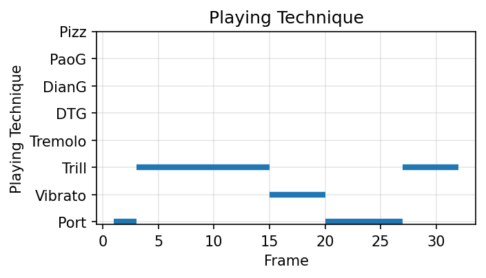</td>
      <td><audio controls preload="none"><source src="assets/audio/ccom-huqin/ccom_31_31_PLaTune-BDA_Ours_style1.mp3" type="audio/mpeg"></audio></td>
      <td><audio controls preload="none"><source src="assets/audio/ccom-huqin/ccom_31_31_PLaTune_Baseline_style1.mp3" type="audio/mpeg"></audio></td>
    </tr>
  </tbody>
</table>

## Reference  

 - Jun, H., Child, R., Chen, M., Schulman, J., Ramesh, A., Radford, A., Sutskever, I., 2020. Distribution Augmentation for Generative Modeling, in: III, H.D., Singh, A. (Eds.), Proceedings of the 37th International Conference on Machine Learning, Proceedings of Machine Learning Research. PMLR, pp. 5006–5019.  
 - Zhang, Y., Zhou, Z., Li, X., Yu, F., Sun, M., 2023. CCOM-HuQin: An Annotated Multimodal Chinese Fiddle Performance Dataset. Transactions of the International Society for Music Information Retrieval 6. https://doi.org/10.5334/tismir.146

